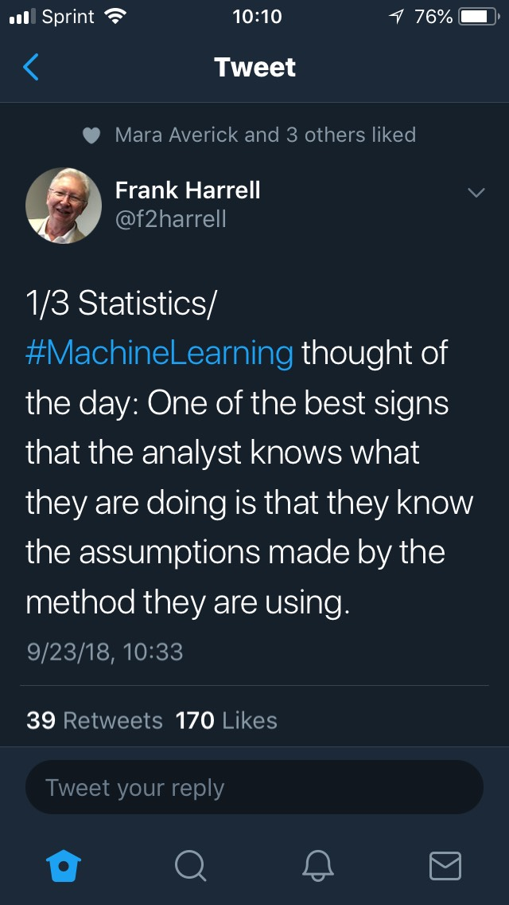

```{r setup, include=FALSE}
library(rvest)
library(readr)
library(dplyr)
library(tidyr)
library(lubridate)
library(stringr)
library(ggplot2)

fig.path = "Graphs"
```

## Topic

Co-presentation with Kevin Feasel (linear regression). 

### Simple Linear Regression with mtcars
```{r mtcars, warning = FALSE, error = FALSE, message = FALSE, tidy = FALSE}
mtcars_lm <- lm(mtcars$mpg ~ mtcars$wt)

ggplot(mtcars, aes(x = wt, y = mpg)) +
    geom_point(shape = 1) +
    geom_smooth(method = lm, se = FALSE) + 
    labs(title = paste("Adj R2 = ", signif(summary(mtcars_lm)$adj.r.squared, 2),
                       "Intercept = ", signif(mtcars_lm$coefficients[[1]], 2),
                       " Slope = ", signif(mtcars_lm$coefficients[[2]], 2),
                       " P = ", signif(summary(mtcars_lm)$coefficients[2,4], 2)))

par(mfrow = c(2,2))
plot(mtcars_lm)

```

### R code for regression of Carolina Godiva Summer Track Series (2018) data.
```{r trackres, warning = FALSE, error = FALSE, message = FALSE, tidy = FALSE}
# Produced from 2018 results websites 
# see SumTrack2018.Rmd in the R subfolder
track_res <- read.csv('godiva_summer_track_res_2018.csv')
track_res$Date_Meet <- ymd(track_res$Date_Meet)

track_res <- track_res %>% group_by(Name) %>% 
               arrange(Name, Date_Meet, ct_evt) %>%
               mutate(EventNum = row_number()) %>% 
               group_by(Name, Date_Meet) %>%
               mutate(EventDay = row_number()) %>%
               group_by(Name, dist_m, Date_Meet) %>%
               mutate(DistNum = row_number()) %>%
               ungroup()

all_dates <- sort(unique(track_res$Date_Meet))
# downloaded from 'https://www.carolinagodiva.org/index.php?page=track-season-weather-conditions')
# see SumTrack2018.R in the R subfolder
temps_2018      <- read_csv("temps_2018.csv")
track_res <- left_join(track_res, temps_2018, by = 'Date_Meet')

track_res %>% dplyr::filter(Name=='Rick Pack' & Date_Meet==ymd('2018-08-01'))

track_res_base <- track_res %>% 
    mutate(Sex_num = case_when(
        Sex == "M" ~ 0,
        Sex == "F" ~ 1)) %>%
    select(Sex_num, Age, dist_m, track_time, DistNum, EventNum, EventDay, Temp)
track_lm <- lm(track_time ~ . , track_res_base)
summary(track_lm)
# Intercept absolute value is large and P-value (testing != 0) supports 
# stat significance
# Model appears to be flawed

# What rows have missing data given lm reported 
# 246 'observations deleted due to missingness'?
which(! complete.cases(track_res_base))
track_res_base[c(3, 20, 27), ]

# Keep only complete cases
track_res_base_complete <- track_res_base[complete.cases(track_res_base),]
```

## Flawed model, let's look at plots (the usual first step)


```{r plot1}
plot(track_res_base_complete)
```

### No variable looks linear to the response variable track_time (column 4) but the combination of explanatory parameters (coefficients * explanatory variables) could be.
```{r plot2}
track_res_base_complete$Predicted <- fitted(track_lm)
ggplot(track_res_base_complete, aes(x = Predicted, y = track_time)) +
    geom_point(shape = 1) +
    geom_smooth(method = lm, se = FALSE) + 
    labs(title = paste("Adj R2 = ", signif(summary(track_lm)$adj.r.squared, 2),
                       "Intercept = ", signif(track_lm$coefficients[[1]], 2),
                       " P = ", signif(summary(track_lm)$coefficients[2,4], 2)),
         subtitle = "CGTC Summer Track Series (2018)")
```

### Let's run the model only for the 100 meter run
```{r 100m_lm2, warning = FALSE, error = FALSE, message = FALSE, echo = FALSE, tidy = FALSE}
track_res_base_complete_100 <- track_res_base[complete.cases(track_res_base),] %>%
                            dplyr::filter(dist_m == 100) %>%
                            # no variation for these
                            select(-DistNum, -dist_m)
    
track100_lm <- lm(track_time ~ . , track_res_base_complete_100)

track_res_base_complete_100$Predicted <- fitted(track100_lm)
head(track_res_base_complete_100 %>% select(Age, track_time, Predicted))

summary(track100_lm)
ggplot(track_res_base_complete_100, aes(x = Predicted, y = track_time)) +
    geom_point(shape = 1) +
    geom_smooth(method = lm, se = FALSE) + 
    labs(title = paste("Adj R2 = ", signif(summary(track100_lm)$adj.r.squared, 2),
                       "Intercept = ", signif(track100_lm$coefficients[[1]], 2),
                       " P = ", signif(summary(track100_lm)$coefficients[2,4], 2)),
        subtitle = "CGTC 100 meters (2018)")
```

### Higher times are a problem. Exploding the error and killing r-squared. Eliminate times above 28 seconds for the 100 (nine track_times)
     
```{r 100m_lm3, warning = FALSE, error = FALSE, message = FALSE, echo = FALSE, tidy = FALSE}
track_res_base_complete_100_fast <- track_res_base_complete_100 %>%
                                      dplyr::filter(track_time <= 28)
    
track100_fast_lm <- lm(track_time ~ . , track_res_base_complete_100_fast)

track_res_base_complete_100_fast$Predicted <- fitted(track100_fast_lm)
head(track_res_base_complete_100_fast %>% select(Age, track_time, Predicted))

summary(track100_fast_lm)
ggplot(track_res_base_complete_100_fast, aes(x = Predicted, y = track_time)) +
    geom_point(shape = 1) +
    geom_smooth(method = lm, se = FALSE) + 
    labs(title = paste("Adj R2 = ", signif(summary(track100_fast_lm)$adj.r.squared, 2),
                       "Intercept = ", signif(track100_fast_lm$coefficients[[1]], 2),
                       " P = ", signif(summary(track100_fast_lm)$coefficients[2,4], 2)),
         subtitle = "CGTC 100 meters (2018) - times under 28 seconds")
```

###### We might pursue more adjustments, dropping insignificant predictors, and possibly a different kind of model than a linear one. Of course, this also illustrates the importance of checking the statistical assumptions first, as Dr. Frank Harrell cautions - and this extends beyond machine learning.


```{r tweetURL, warning = FALSE, error = FALSE, message = FALSE, echo = FALSE, tidy = FALSE}
print("https://twitter.com/f2harrell/status/1043871065498357760?s=12")
```