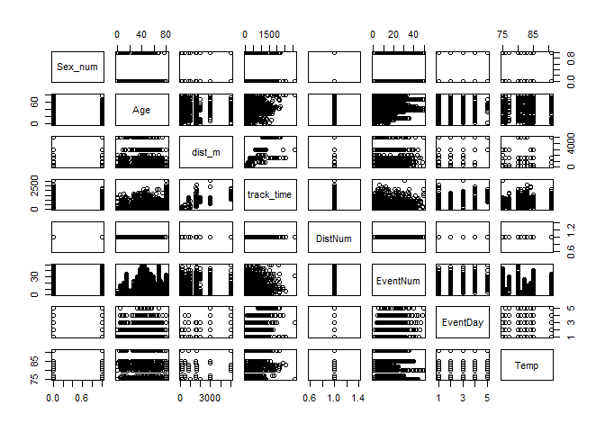

Linear Regression for TriPASS Data Sci 20180925 Meetup
================
Rick Pack
September 24, 2018

Topic
-----

Co-presentation with Kevin Feasel (linear regression).

### Simple Linear Regression with mtcars

``` r
mtcars_lm <- lm(mtcars$mpg ~ mtcars$wt)

ggplot(mtcars, aes(x = wt, y = mpg)) +
    geom_point(shape = 1) +
    geom_smooth(method = lm, se = FALSE) + 
    labs(title = paste("Adj R2 = ", signif(summary(mtcars_lm)$adj.r.squared, 2),
                       "Intercept = ", signif(mtcars_lm$coefficients[[1]], 2),
                       " Slope = ", signif(mtcars_lm$coefficients[[2]], 2),
                       " P = ", signif(summary(mtcars_lm)$coefficients[2,4], 2)))
```


``` r
par(mfrow = c(2,2))
plot(mtcars_lm)
```


### R code for regression of Carolina Godiva Summer Track Series (2018) data.

``` r
# Produced from 2018 results websites 
# see SumTrack2018.Rmd in the R subfolder
track_res <- read.csv('godiva_summer_track_res_2018.csv')
track_res$Date_Meet <- ymd(track_res$Date_Meet)

track_res <- track_res %>% group_by(Name) %>% arrange(Name, Date_Meet, ct_evt) %>%
               mutate(EventNum = row_number()) %>% 
               group_by(Name, Date_Meet) %>%
               mutate(EventDay = row_number()) %>%
               group_by(Name, dist_m, Date_Meet) %>%
               mutate(DistNum = row_number()) %>%
               ungroup()

all_dates <- sort(unique(track_res$Date_Meet))
# downloaded from 'https://www.carolinagodiva.org/index.php?page=track-season-weather-conditions')
# see SumTrack2018.R in the R subfolder
temps_2018      <- read_csv("temps_2018.csv")
track_res <- left_join(track_res, temps_2018, by = 'Date_Meet')

track_res %>% dplyr::filter(Name=='Rick Pack' & Date_Meet==ymd('2018-08-01'))
```

    ## # A tibble: 2 x 21
    ##   Name      Sex     Age Time  ct_evt Event      mins  secs track_time
    ##   <chr>     <chr> <int> <chr>  <int> <chr>     <int> <dbl>      <dbl>
    ## 1 Rick Pack M        37 24.2    2000 200 M Run     0  24.2       24.2
    ## 2 Rick Pack M        37 2:30    4000 800 M Run     2  30        150  
    ##   temp_dist dist_m0 dist_m Date_Meet  agegrp      rownum Place
    ##   <chr>       <int>  <dbl> <date>     <chr>        <int> <int>
    ## 1 200           200    200 2018-08-01 Age 35 - 39      1     3
    ## 2 800           800    800 2018-08-01 Age 35 - 39      1     9
    ##   Max_Hamlyn_pts EventNum EventDay DistNum  Temp
    ##            <int>    <int>    <int>   <int> <int>
    ## 1              3       21        1       1    80
    ## 2              0       22        2       1    80

``` r
track_res_base <- track_res %>% 
    mutate(Sex_num = case_when(
        Sex == "M" ~ 0,
        Sex == "F" ~ 1)) %>%
    select(Sex_num, Age, dist_m, track_time, DistNum, EventNum, EventDay, Temp)
track_lm <- lm(track_time ~ . , track_res_base)
summary(track_lm)
```

    ## 
    ## Call:
    ## lm(formula = track_time ~ ., data = track_res_base)
    ## 
    ## Residuals:
    ##     Min      1Q  Median      3Q     Max 
    ## -440.11  -91.19  -39.31   46.31 2050.36 
    ## 
    ## Coefficients: (1 not defined because of singularities)
    ##                Estimate  Std. Error t value             Pr(>|t|)    
    ## (Intercept) -131.277079   80.356493  -1.634              0.10250    
    ## Sex_num       53.359036    9.076228   5.879         0.0000000049 ***
    ## Age            2.513876    0.243406  10.328 < 0.0000000000000002 ***
    ## dist_m         0.312882    0.003834  81.614 < 0.0000000000000002 ***
    ## DistNum              NA          NA      NA                   NA    
    ## EventNum       1.346987    0.449397   2.997              0.00276 ** 
    ## EventDay      19.023810    4.250259   4.476         0.0000080797 ***
    ## Temp          -0.382218    0.969904  -0.394              0.69357    
    ## ---
    ## Signif. codes:  0 '***' 0.001 '**' 0.01 '*' 0.05 '.' 0.1 ' ' 1
    ## 
    ## Residual standard error: 186.6 on 1820 degrees of freedom
    ##   (10 observations deleted due to missingness)
    ## Multiple R-squared:  0.8157, Adjusted R-squared:  0.8151 
    ## F-statistic:  1342 on 6 and 1820 DF,  p-value: < 0.00000000000000022

``` r
# Intercept absolute value is large and P-value (testing != 0) supports 
# stat significance
# Model appears to be flawed

# What rows have missing data given lm reported 
# 246 'observations deleted due to missingness'?
which(! complete.cases(track_res_base))
```

    ##  [1]   13   14  382  383  446  780  781 1525 1526 1527

``` r
track_res_base[c(3, 20, 27), ]
```

    ## # A tibble: 3 x 8
    ##   Sex_num   Age dist_m track_time DistNum EventNum EventDay  Temp
    ##     <dbl> <int>  <dbl>      <dbl>   <int>    <int>    <int> <int>
    ## 1       1    42  3000       790         1        3        3    76
    ## 2       1    12   200        28.5       1        3        1    82
    ## 3       1    44  1609.      839         1        6        3    80

``` r
# Keep only complete cases
track_res_base_complete <- track_res_base[complete.cases(track_res_base),]
```

Flawed model, let's look at plots (the usual first step)
--------------------------------------------------------

``` r
plot(track_res_base_complete)
```



### No variable looks linear to the response variable track\_time (column 4) but the combination of explanatory parameters (coefficients \* explanatory variables) could be.

``` r
track_res_base_complete$Predicted <- fitted(track_lm)
ggplot(track_res_base_complete, aes(x = Predicted, y = track_time)) +
    geom_point(shape = 1) +
    geom_smooth(method = lm, se = FALSE) + 
    labs(title = paste("Adj R2 = ", signif(summary(track_lm)$adj.r.squared, 2),
                       "Intercept = ", signif(track_lm$coefficients[[1]], 2),
                       " P = ", signif(summary(track_lm)$coefficients[2,4], 2)),
         subtitle = "CGTC Summer Track Series (2018)")
```


### Let's run the model only for the 100 meter run

    ## # A tibble: 6 x 3
    ##     Age track_time Predicted
    ##   <int>      <dbl>     <dbl>
    ## 1    57       14.8      21.3
    ## 2    11       15.8      16.1
    ## 3    36       13.5      17.5
    ## 4    32       14.4      17.0
    ## 5    27       16.3      17.2
    ## 6    27       19.1      17.5

    ## 
    ## Call:
    ## lm(formula = track_time ~ ., data = track_res_base_complete_100)
    ## 
    ## Residuals:
    ##     Min      1Q  Median      3Q     Max 
    ## -10.154  -4.149  -1.702   1.429  60.989 
    ## 
    ## Coefficients:
    ##             Estimate Std. Error t value Pr(>|t|)    
    ## (Intercept) 13.17500   15.38808   0.856 0.393029    
    ## Sex_num      1.04311    1.41201   0.739 0.461020    
    ## Age          0.13712    0.03447   3.978 0.000101 ***
    ## EventNum     0.05468    0.09802   0.558 0.577640    
    ## EventDay    -2.00147    1.71281  -1.169 0.244129    
    ## Temp         0.03926    0.17975   0.218 0.827369    
    ## ---
    ## Signif. codes:  0 '***' 0.001 '**' 0.01 '*' 0.05 '.' 0.1 ' ' 1
    ## 
    ## Residual standard error: 9.475 on 181 degrees of freedom
    ## Multiple R-squared:  0.09167,    Adjusted R-squared:  0.06658 
    ## F-statistic: 3.653 on 5 and 181 DF,  p-value: 0.003575


### Higher times are a problem. Exploding the error and killing r-squared. Eliminate times above 28 seconds for the 100 (nine track\_times)

    ## # A tibble: 6 x 3
    ##     Age track_time Predicted
    ##   <int>      <dbl>     <dbl>
    ## 1    57       14.8      19.6
    ## 2    11       15.8      15.4
    ## 3    36       13.5      16.1
    ## 4    32       14.4      16.0
    ## 5    27       16.3      18.7
    ## 6    27       19.1      18.7

    ## 
    ## Call:
    ## lm(formula = track_time ~ ., data = track_res_base_complete_100_fast)
    ## 
    ## Residuals:
    ##     Min      1Q  Median      3Q     Max 
    ## -6.5696 -2.4430 -0.0728  1.7368  8.7967 
    ## 
    ## Coefficients: (1 not defined because of singularities)
    ##              Estimate Std. Error t value     Pr(>|t|)    
    ## (Intercept) 15.317707   5.240862   2.923      0.00394 ** 
    ## Sex_num      2.800755   0.482774   5.801 0.0000000309 ***
    ## Age          0.031050   0.012134   2.559      0.01136 *  
    ## EventNum     0.011464   0.033198   0.345      0.73028    
    ## EventDay    -0.075588   0.581952  -0.130      0.89681    
    ## Temp        -0.002553   0.061176  -0.042      0.96676    
    ## Predicted          NA         NA      NA           NA    
    ## ---
    ## Signif. codes:  0 '***' 0.001 '**' 0.01 '*' 0.05 '.' 0.1 ' ' 1
    ## 
    ## Residual standard error: 3.163 on 172 degrees of freedom
    ## Multiple R-squared:  0.1913, Adjusted R-squared:  0.1678 
    ## F-statistic: 8.139 on 5 and 172 DF,  p-value: 0.0000006447


###### We might pursue more adjustments, dropping insignificant predictors, and possibly a different kind of model than a linear one. Of course, this also illustrates the importance of checking the statistical assumptions first, as Dr. Frank Harrell cautions - and surely this extends beyond machine learning.


    ## [1] "https://twitter.com/f2harrell/status/1043871065498357760?s=12"
